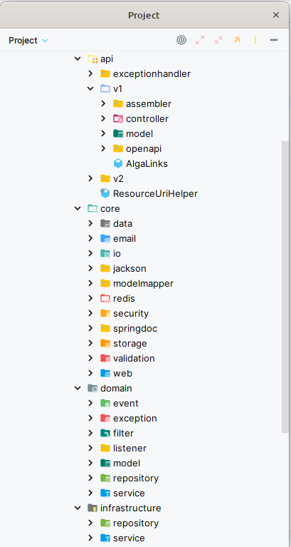
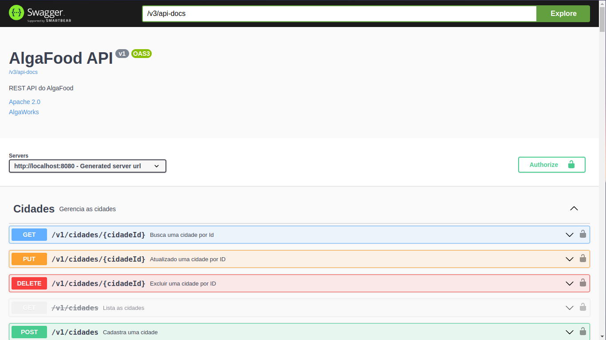

# Curso Especialista Spring Rest

## REST API desenvolvida com Spring Boot seguindo as melhoras práticas do mercado.

## Tecnologias / Frameworks
 - SpringBoot 2.7 e 3.0
 - Spring Data JPA
 - Sprint Security
 - Maven
 - MySQL
 - Flyway
 - Java 11/17
 - OAuth2
 - Docker
 - Redis
 - OpenAPI/Swagger/SpringDoc
 - Squiggly
 - Testes de Integração
 - Spring Authorizarion Server (Spring Boot 3)
 - AWS (EC2, ECR, S3, ECS, System Manager, VPC, RDS)

## Conteúdo programático

### Resumo completo de todas as aulas: [Resumo](/minhas-anotacoes/Resumo.md)

### Resumo por capítulo: [resumo](/minhas-anotacoes/)
- [x] Introdução
- [x] Spring e Injeção de Dependências
- [x] Introdução ao JPA e Hibernate
- [x] REST com Spring
- [x] Super poderes do Spring Data JPA
- [x] Explorando mais do JPA e Hibernate
- [x] Pool de conexões e Flyway
- [x] Tratamento e modelagem de erros da API
- [x] Validações com Bean Validation
- [x] Testes de integração
- [x] Boas práticas e técnicas para APIs
- [x] Modelagem avançada e implementação da API
- [x] Modelagem de projeções, pesquisas e relatórios
- [x] Upload e download de arquivos
- [x] E-mails transacionais e Domain Events
- [x] CORS e consumo da API com JavaScript e Java
- [x] Cache de HTTP
- [x] Documentação da API com OpenAPI, Swagger UI e SpringFox
- [x] Discoverability e HATEOAS A Glória do REST
- [x] Evoluindo e versionando a API
- [x] Logging
- [x] Segurança com Spring Security e OAuth2
- [x] OAuth2 avançado com JWT e controle de acesso
- [x] Deploy em produção
> atualizações:
- [x] Documentação da API com SpringDoc
- [x] Spring Authorization Server
- [x] Spring Boot 3

# Modelo de Domínio usando DDD


# Estrutura do Projeto



## Documentação no Swagger



### Instruições de uso da documentação

É necessário se autenticar na aplicação através do swagger para explorar os endpoints
```
 > client_id: joao.ger@algafood.com

 > client_secret: 123

 O usuário acima tem autenticação em todos os endpoints pois é um usuário administrador, mas se for um usuário comun, alguns endpoints estarão inacessíveis. Crie um usuário comum  no endpoint para logar com ele 
 ```